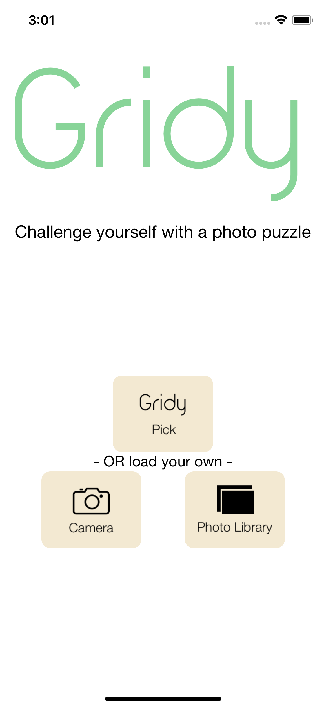
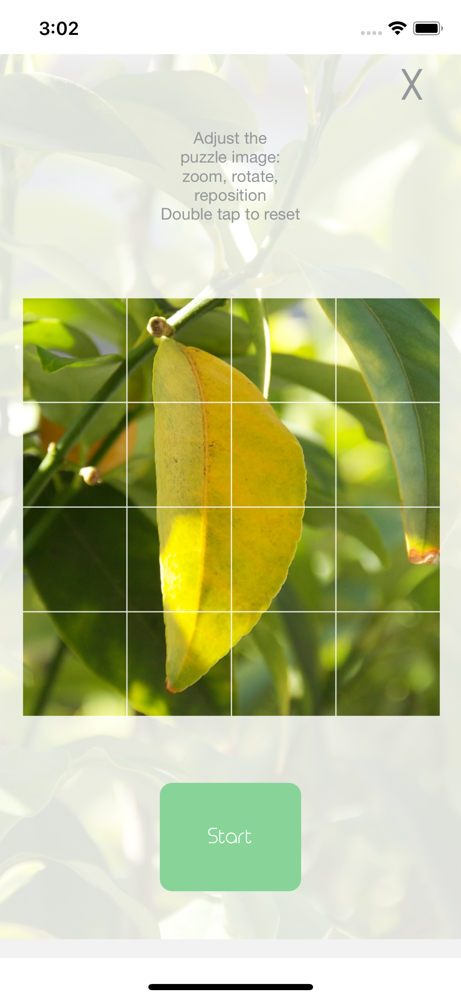
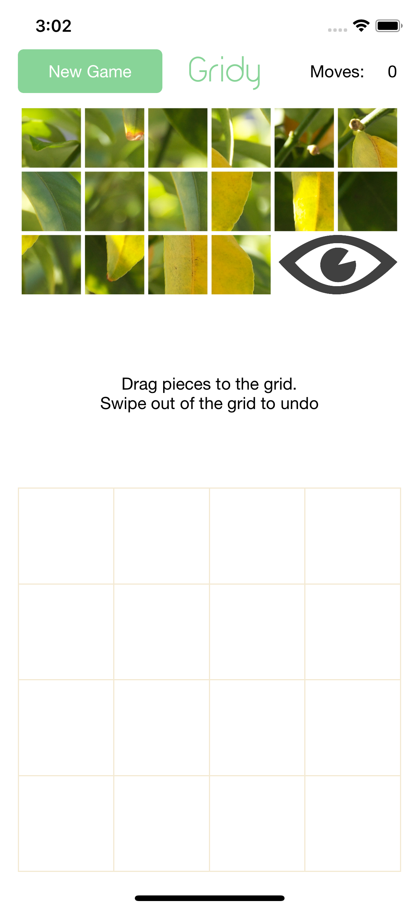
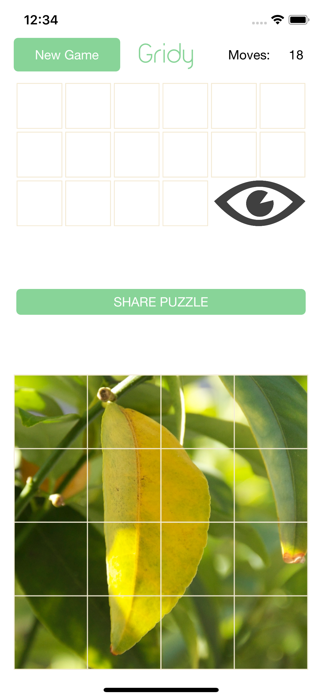
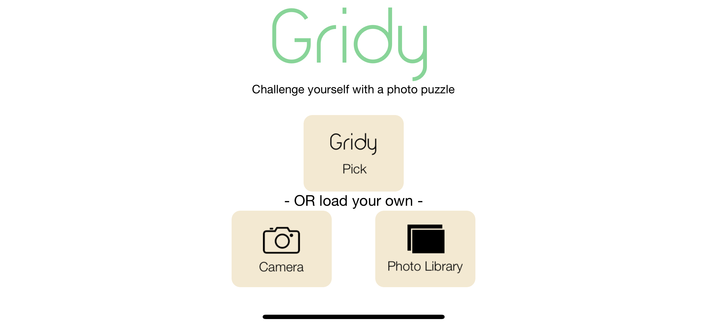
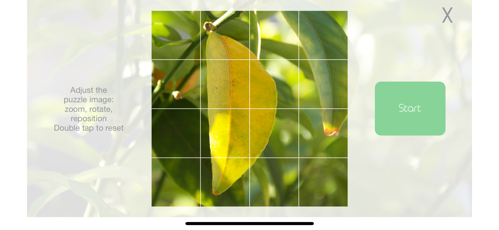
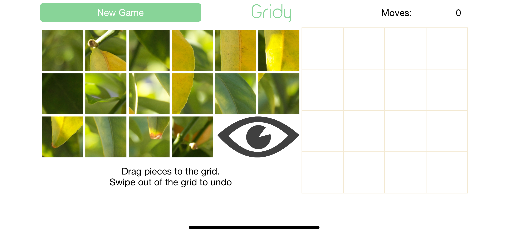
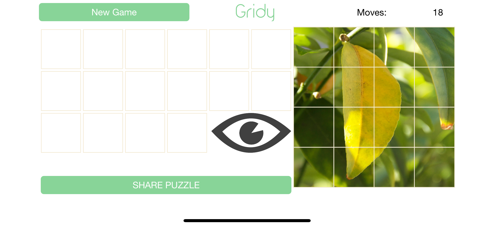

## Gridy App - Adaptive app (iPhones and iPads) - No Storyboard

This is a simple puzzle game of 16 pieces. 
The user can create a puzzle using a picture from her/his camera or photo library.
The user can share the completed puzzle picture at the end (email, social media, etc). 
The application counts the number of moves used to solve the puzzle, 16 moves being a perfect score.
There is a "hint" feature to help the user solve the puzzle.

## Steps:
1. Select image (random, image library or camera)
2. Edit the image (rotate, move or zoom)
3. Solve the puzzle (the fewer the moves, the better)
4. Share your solved puzzle with friends

## Contact:
If you have any questions contact me at <a href="mailto:spencer.forrest.ios@gmail.com">spencer.forrest.ios@gmail.com</a>

## Screenshots:
## Portrait

## Landscape

